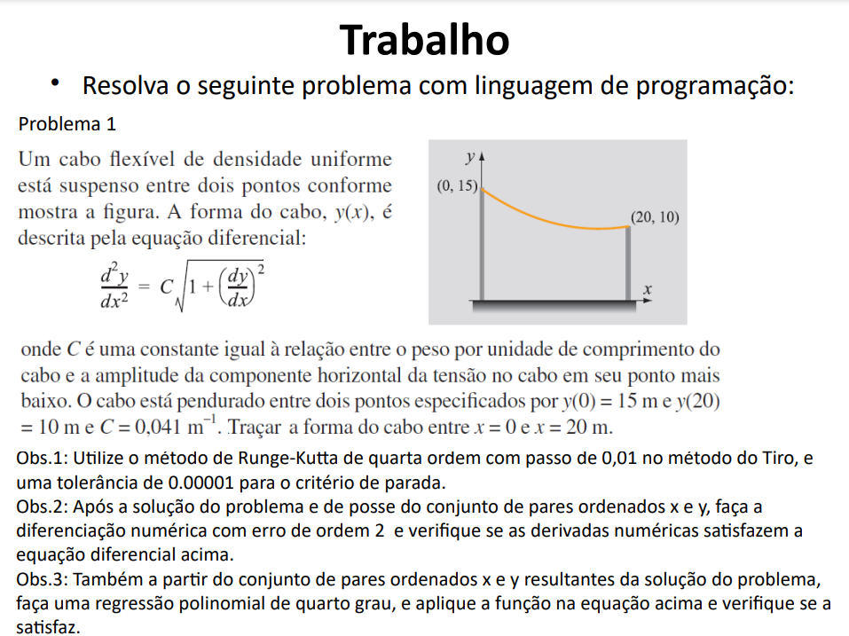

# Trabalho - Métodos Numéricos (UnB)

Este repositório contém a implementação em desenvolvimento de um trabalho da disciplina de **Métodos Numéricos** da Universidade de Brasília (UnB).

O problema envolve a resolução de uma equação diferencial não linear que descreve a forma de um cabo flexível suspenso entre dois pontos, utilizando o **método de Runge-Kutta de quarta ordem** com o **método do Tiro**. Também serão feitas análises de derivadas numéricas e regressão polinomial conforme especificado no enunciado.

## Detalhes do Problema



> 📌 O trabalho está **em desenvolvimento** e este repositório será atualizado conforme o progresso da implementação.

## Dependências

Este projeto utiliza as seguintes bibliotecas Python:

- **numpy** - Para computações numéricas e arrays
- **matplotlib** - Para visualização de gráficos e plots

## 🚀 Instalação e Configuração

### Pré-requisitos

- Python 3.8 ou superior
- Poetry (recomendado) ou pip

### Opção 1: Usando Poetry (Recomendado)

1. **Clone o repositório:**

   ```bash
   git clone https://github.com/TiagoSBittencourt/Numerical-Methods-Class-Project.git
   cd Numerical-Methods-Class-Project
   ```

2. **Instale o Poetry** (se ainda não tiver instalado):

   ```bash
   curl -sSL https://install.python-poetry.org | python3 -
   ```

   Ou no Windows:

   ```powershell
   (Invoke-WebRequest -Uri https://install.python-poetry.org -UseBasicParsing).Content | python -
   ```

3. **Instale as dependências:**

   ```bash
   poetry install
   ```

4. **Execute os scripts:**

   ```bash
   # Executar o arquivo principal
   poetry run python main.py

   # Ou ativar o ambiente virtual
   poetry shell
   python main.py
   ```

### Opção 2: Usando pip

1. **Clone o repositório:**

   ```bash
   git clone https://github.com/TiagoSBittencourt/Numerical-Methods-Class-Project.git
   cd Numerical-Methods-Class-Project
   ```

2. **Crie um ambiente virtual (opcional, mas recomendado):**

   ```bash
   python -m venv venv

   # No Windows
   venv\Scripts\activate

   # No Linux/macOS
   source venv/bin/activate
   ```

3. **Instale as dependências:**

   ```bash
   # Opção A: Usar Poetry (mesmo se você preferir pip, isso funcionará)
   poetry install

   # Opção B: Instalar manualmente com pip
   pip install numpy matplotlib
   ```

4. **Execute os scripts:**
   ```bash
   python main.py
   ```

## 📂 Estrutura do Projeto

```
Numerical-Methods-Class-Project/
├── main.py              # Script principal - executa Obs.1, Obs.2 e Obs.3
├── solvers_edo.py       # Implementação dos métodos RK1, RK2, RK4 e Tiro
├── numerical_dif.py     # Classe para diferenciação numérica (Obs.2)
├── obs3_regressao.py    # Implementação da regressão polinomial (Obs.3)
├── pyproject.toml       # Configuração do Poetry
├── README.md            # Este arquivo
└── assets/
    └── DetalhesTrabalho.png
```

## 🔧 Uso

### Executando o Projeto Principal

```bash
poetry run python main.py
```

Este comando executará sequencialmente todas as observações do trabalho:

- **Obs.1**: Resolução da EDO usando método do Tiro com RK4 (com relatório detalhado)
- **Obs.2**: Diferenciação numérica e verificação da EDO (com relatório detalhado)
- **Obs.3**: Regressão polinomial de grau 4 e verificação da EDO

### 📊 Relatórios Detalhados

O projeto gera relatórios completos no terminal para cada observação:

**Obs.1 e Obs.2:**

- ✅ Parâmetros do problema (constantes, intervalos, condições)
- ✅ Estatísticas da solução (valores min/max/médio, erro nas condições de contorno)
- ✅ Valores da solução em pontos específicos
- ✅ Comparação entre derivadas analíticas (RK4) e numéricas
- ✅ Verificação detalhada da EDO com métricas de erro
- ✅ Tabela de derivadas em pontos de interesse
- ✅ Avaliação da qualidade da solução

**Obs.3:**

- ✅ Coeficientes do polinômio de grau 4
- ✅ Derivadas analíticas do polinômio
- ✅ Coeficiente de determinação R²
- ✅ Erros na satisfação da EDO
- ✅ Gráficos comparativos e de verificação

### Executando Observações Individuais

```bash
# Executar apenas Obs.3 (regressão polinomial)
poetry run python regressao.py

# Testar diferenciação numérica (Obs.2)
poetry run python numerical_dif.py

# Testar resolvedores de EDO
poetry run python solvers_edo.py
```

## 📋 Comandos Úteis do Poetry

- `poetry show` - Lista todas as dependências instaladas
- `poetry add <package>` - Adiciona uma nova dependência
- `poetry shell` - Ativa o ambiente virtual
- `poetry run <command>` - Executa comando no ambiente virtual
- `poetry update` - Atualiza todas as dependências

## 📄 Geração de Relatório PDF

O projeto inclui funcionalidade para gerar um relatório técnico detalhado em PDF:

### Como gerar o relatório:

1. **Execute o programa principal:**

   ```bash
   python main.py
   ```

2. **Quando solicitado, responda 's' para gerar o PDF:**

   ```
   Deseja gerar um relatório PDF detalhado? (s/n): s
   ```

3. **O arquivo `relatorio_metodos_numericos.pdf` será criado** contendo:
   - Análise detalhada de todos os métodos numéricos
   - Tabelas com resultados e estatísticas de erro
   - Coeficientes da regressão polinomial
   - Verificação da equação diferencial
   - Conclusões técnicas e metodologia

### Conteúdo do relatório PDF:

- **Seção 1**: Método do Tiro com Runge-Kutta 4ª ordem
- **Seção 2**: Diferenciação numérica e verificação da EDO
- **Seção 3**: Regressão polinomial de grau 4
- **Seção 4**: Conclusões gerais e análise comparativa
- **Seção 5**: Metodologia e implementação

O relatório é ideal para apresentações acadêmicas e documentação técnica do projeto.
